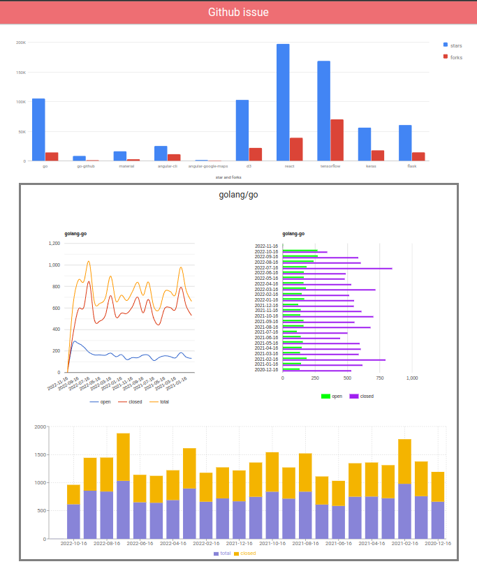

# GITHUB-ISSUE-TRACKER

## Docker compose method

1) install docker compose on local system
2) `docker-compose up --build` 
3) App running on http://localhost:3000/

---
## Fetch updated data

1) `ADD YOUR GITHUB TOKEN in collect_data.py file line number 13`
2) `python3 -m venv env`
3) `source /env/bin/activate`
4) `pip3 install -r requirements.txt`
5) `python3 collect_data.py`

## UI demo
